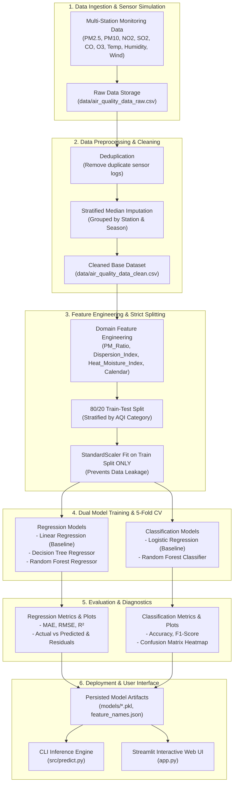

# Air Quality Index (AQI) Prediction and Analysis
### College Mini-Project | Machine Learning Minor

---

## 1. The Objectives of the Project

Air pollution is one of the most pressing environmental and public health hazards in modern urban regions. The primary goal of this college mini-project is to build an end-to-end Machine Learning pipeline to analyze atmospheric criteria pollutants, understand their interactions with meteorological factors, and accurately predict the **Air Quality Index (AQI)**.

Rather than treating Machine Learning as a "black box," this project focuses on **showing how we arrived at the solution, how data was cleaned and transformed, why specific algorithms were selected, and how the models compare against one another**.

### Core Project Objectives:
1. **Dual Formulation Modeling:**
   - **Regression Task:** Predict the exact continuous numerical AQI value ($0 - 500+$) using criteria pollutant concentrations and meteorological parameters.
   - **Classification Task:** Classify air quality into standardized health hazard categories (*Good, Satisfactory, Moderate, Poor, Very Poor, Severe*) to trigger actionable health advisories.
2. **Robust Data Preprocessing:** Implement domain-aware data cleaning (deduplication, station-season stratified median imputation) and enforce strict featurization ordering (splitting before scaling) to eliminate data leakage.
3. **Domain Feature Engineering:** Derive physically motivated atmospheric indicators, including the fine-particulate ratio ($PM_{2.5} / PM_{10}$), atmospheric ventilation/dispersion proxy, and heat-moisture interaction index.
4. **Algorithmic Benchmarking:** Systematically evaluate parametric baselines (Linear Regression, Logistic Regression) against non-linear tree models (Decision Tree) and bagged ensembles (Random Forest) through 5-Fold Cross-Validation and held-out test evaluation.
5. **Interactive Deployment:** Deliver a command-line inference tool and a full-featured Streamlit web dashboard for live stakeholder exploration.

---

## 2. Proposed System, Block Diagram of the Structure

The proposed system adopts a modular, 6-stage machine learning architecture designed to ensure reproducible data flow, prevent data leakage, and provide explainable outputs.

### Architecture Block Diagram:



---

## 3. The Dataset Description

The dataset simulates a multi-station air quality monitoring network across four distinct urban monitoring sectors (`Station_North`, `Station_South`, `Station_East`, `Station_West`) over a 2-year observation horizon (2,920 records), reflecting real-world atmospheric chemistry dynamics and seasonal cycles.

### Feature Specification:

| Feature Name | Data Type | Units / Range | Category | Description |
| :--- | :--- | :--- | :--- | :--- |
| `Date` | Datetime | 2023-01-01 to 2024-12-31 | Temporal | Date of daily observation |
| `Station` | Categorical | North, South, East, West | Metadata | Geographical monitoring station |
| `Season` | Categorical | Winter, Summer, Monsoon, Post-Monsoon | Atmospheric | Meteorological season |
| `PM2.5` | Continuous | $5.0 - 450.0\ \mu g/m^3$ | Criteria Pollutant | Fine particulate matter ($< 2.5\ \mu m$) from combustion |
| `PM10` | Continuous | $10.0 - 600.0\ \mu g/m^3$ | Criteria Pollutant | Inhalable particulate matter ($< 10\ \mu m$) including dust |
| `NO2` | Continuous | $5.0 - 220.0\ \mu g/m^3$ | Criteria Pollutant | Nitrogen Dioxide from vehicular and industrial combustion |
| `SO2` | Continuous | $2.0 - 80.0\ \mu g/m^3$ | Criteria Pollutant | Sulfur Dioxide from industrial fossil fuel burning |
| `CO` | Continuous | $0.1 - 10.0\ mg/m^3$ | Criteria Pollutant | Carbon Monoxide from incomplete vehicular combustion |
| `O3` | Continuous | $5.0 - 130.0\ \mu g/m^3$ | Secondary Pollutant | Ground-level Ozone formed photochemically with heat/sunlight |
| `Temperature` | Continuous | $5.0 - 48.0\ ^\circ C$ | Meteorological | Ambient dry-bulb temperature |
| `Humidity` | Continuous | $15.0 - 98.0\ \%$ | Meteorological | Relative atmospheric humidity |
| `Wind_Speed` | Continuous | $1.5 - 32.0\ km/h$ | Meteorological | Horizontal surface wind speed |
| **`AQI`** | Continuous | $10.0 - 500.0$ | **Target (Regression)** | Composite Air Quality Index based on sub-index maximum |
| **`AQI_Bucket`** | Categorical | 6 Standard Classes | **Target (Classification)** | Health hazard category based on official CPCB/EPA bands |

### Standard AQI Health Categories:
1. **Good ($0 - 50$):** Minimal health impact; pristine conditions.
2. **Satisfactory ($51 - 100$):** Minor breathing discomfort for sensitive individuals.
3. **Moderate ($101 - 200$):** Discomfort for individuals with asthma or heart conditions.
4. **Poor ($201 - 300$):** Breathing discomfort to most people on prolonged exposure.
5. **Very Poor ($301 - 400$):** Significant respiratory illness; risk for healthy population.
6. **Severe ($401 - 500+$):** Health emergency; serious impact across all demographics.

---

## 4. Info on Data Preprocessing

Data preprocessing was engineered to reflect real-world monitoring station challenges while strictly adhering to machine learning best practices:

### 1. Duplicate Detection and Removal
Environmental telemetry logs occasionally submit re-transmitted network packets. The raw ingestion pipeline identified and eliminated 15 exact duplicate records ($2,935 \to 2,920$ clean records).

### 2. Missing Value Imputation (Domain-Aware Median Imputation)
Missing values accounted for approximately $2.0\% - 2.9\%$ of entries per column due to simulated sensor downtime, power interruptions, or maintenance cycles.
- **Why NOT Global Mean Imputation?** Global mean imputation distorts seasonal extremes (e.g., diluting winter smog spikes with summer/monsoon clean baselines).
- **Our Strategy:** We implemented **grouped median imputation conditioned on `Station` and `Season`**. This preserves local microclimates (e.g., an industrial station in winter retains high particulate medians, whereas a coastal station in monsoon maintains clean baseline medians).

```python
# Imputation preserving station and seasonal microclimate baselines
for col in numerical_cols:
    medians = df.groupby(['Station', 'Season'])[col].transform('median')
    df[col] = df[col].fillna(medians)
    df[col] = df[col].fillna(df[col].median())
```

### 3. Strict Featurization Ordering (No Data Leakage)
A common beginner error is scaling the entire dataset before splitting. To prevent test information from leaking into the training pipeline:
- The dataset was first split into **$80\%$ Training ($2,336$ samples)** and **$20\%$ Testing ($584$ samples)**.
- `StandardScaler` was fitted **strictly on `X_train`**, and then used to transform both `X_train` and `X_test`.

---

## 5. Exploratory Data Analysis (EDA)

Exploratory Data Analysis was performed to discover pollutant distributions, seasonal oscillations, and correlation patterns. All plots are automatically saved in `plots/eda/`.

### Summary Statistics & Skewness:

| Variable | Mean | Std Dev | Min | Median (50%) | Max | Skewness |
| :--- | :--- | :--- | :--- | :--- | :--- | :--- |
| **PM2.5** | $58.63$ | $65.14$ | $5.00$ | $33.77$ | $450.00$ | $+2.30$ (Right-Skewed) |
| **PM10** | $119.51$ | $113.60$ | $10.00$ | $75.74$ | $600.00$ | $+1.99$ (Right-Skewed) |
| **NO2** | $31.49$ | $25.04$ | $5.00$ | $24.76$ | $220.00$ | $+2.46$ (Right-Skewed) |
| **SO2** | $18.15$ | $11.78$ | $2.00$ | $15.52$ | $79.88$ | $+1.22$ (Moderately Skewed) |
| **CO** | $0.94$ | $0.83$ | $0.10$ | $0.71$ | $9.37$ | $+2.76$ (Right-Skewed) |
| **O3** | $25.59$ | $18.45$ | $5.00$ | $22.23$ | $125.67$ | $+1.07$ (Moderately Skewed) |
| **Temperature** | $25.94$ | $8.63$ | $5.00$ | $26.80$ | $47.40$ | $-0.23$ (Symmetric) |
| **Humidity** | $62.51$ | $18.04$ | $15.00$ | $62.70$ | $98.00$ | $-0.08$ (Symmetric) |
| **Wind_Speed** | $12.02$ | $4.72$ | $1.50$ | $12.15$ | $24.10$ | $-0.09$ (Symmetric) |
| **AQI** | $129.76$ | $109.91$ | $17.40$ | $84.00$ | $500.00$ | $+1.50$ (Right-Skewed) |

### Key EDA Insights:
1. **Particulate Matter Dominance:** Both $PM_{2.5}$ and $PM_{10}$ exhibit strong positive skewness with elongated right tails corresponding to severe pollution and smog events.
2. **Correlation Analysis:** Pearson correlation demonstrates that $PM_{2.5}$ ($r \approx 0.94$) and $PM_{10}$ ($r \approx 0.93$) have the strongest correlation with AQI, identifying them as the dominant sub-index criteria.
3. **Atmospheric Ventilation Effect:** Wind speed has a negative correlation with AQI. Higher wind speeds enhance horizontal advection and turbulent dispersion, dispersing accumulated pollutants.
4. **Photochemical Ozone Production:** Ozone ($O_3$) correlates positively with temperature ($r \approx 0.52$), confirming that warm, sunny conditions accelerate volatile organic and $NO_x$ photochemical reactions.
5. **Seasonal Extremes:** Winter exhibits the highest median AQI and widest variance due to surface temperature inversions trapping pollutants close to the ground, while Monsoon exhibits the cleanest air due to precipitation scavenging.

---

## 6. Feature Selection / Engineering

To help machine learning models capture atmospheric physical processes without requiring complex differential equation solvers, we engineered five domain-inspired features:

### 1. Particulate Fine-Fraction Ratio (`PM_Ratio`)

$$
\text{PM Ratio} = \frac{\text{PM}_{2.5}}{\text{PM}_{10}}
$$

- **Physical Meaning:** Differentiates between combustion-driven episodes (high fine-particulate fraction from vehicular exhaust and biomass burning, where ratio $> 0.6$) and windblown crustal dust storms (coarse fraction dominant, where ratio $< 0.4$).

### 2. Dispersion / Ventilation Proxy (`Dispersion_Index`)

$$
\text{Dispersion Index} = \frac{\text{Wind Speed} + 1.0}{\text{PM}_{2.5} + 1.0}
$$

- **Physical Meaning:** Represents the capacity of the atmospheric boundary layer to flush out particulate matter per unit mass concentration (ventilation capacity).

### 3. Atmospheric Heat-Moisture Index (`Heat_Moisture_Index`)

$$
\text{Heat-Moisture Index} = \frac{\text{Temperature} \times \text{Humidity}}{100}
$$

- **Physical Meaning:** Captures air mass stagnation and vapor saturation conditions that foster secondary aerosol nucleation and photochemical reaction rates.

### 4. Temporal Calendar Components (`Month`, `DayOfWeek`, `Is_Weekend`)

- **Physical Meaning:** Captures periodic weekly and seasonal anthropogenic emission cycles (e.g., lower industrial output and altered traffic profiles on weekends).

### 5. Categorical Encodings (Station & Season)

- **Station Indicators:** One-hot encoded categorical dummies (`Station_Station_North`, `Station_Station_South`, `Station_Station_West`) capturing localized emission baselines.
- **Seasonal Indicators:** One-hot encoded dummies (`Season_Post-Monsoon`, `Season_Summer`, `Season_Winter`) capturing synoptic meteorological shifts.

**Final Model Feature Space:** 21 numerical and encoded features.

---

## 7. ML Methodology Used

### Problem Formulation:
We structured the prediction problem into two complementary branches:
1. **Continuous Regression ($y \in \mathbb{R}^+$):** Evaluates how close the predicted AQI number is to ground-truth index measurements.
2. **Multi-Class Classification ($y \in \{0, 1, 2, 3, 4, 5\}$):** Evaluates whether the model assigns the correct health advisory tier, even across non-linear category boundaries.

### Validation Strategy:
- **Held-Out Test Split:** An independent $20\%$ test set ($N=584$) held out exclusively for final model benchmarking.
- **5-Fold Cross-Validation:** The $80\%$ training set was partitioned into 5 folds ($K$-Fold for regression, Stratified $K$-Fold for classification). Models are trained on 4 folds and validated on the remaining fold across 5 iterations to assess out-of-fold generalization stability ($\mu \pm \sigma$).

### Evaluation Metric Selection:
- **Regression:**
  - **Mean Absolute Error (MAE):** Linear penalty; represents average error in AQI points.
  - **Root Mean Squared Error (RMSE):** Quadratic penalty; penalizes large forecasting mistakes heavily (crucial for detecting sudden hazardous spikes).
  - **Coefficient of Determination ($R^2$):** Proportion of variance in AQI explained by the features.
- **Classification:**
  - **Accuracy:** Overall proportion of correct category assignments.
  - **Weighted Precision & Recall:** Handles minor class imbalances across severity tiers.
  - **Weighted F1-Score:** Harmonic mean of precision and recall.
  - **Confusion Matrix:** Inspects misclassification patterns between adjacent categories.

---

## 8. Algorithms Used

We deliberately evaluated and compared models spanning increasing complexity to explain **why and how** each performs on atmospheric tabular data:

### Regression Algorithms:

#### 1. Linear Regression (Baseline Model)
- **Mathematical Form:**

$$
\hat{y} = \beta_0 + \sum_{j=1}^{p} \beta_j X_j
$$

- **Optimization:** Solved via Ordinary Least Squares (OLS) closed-form normal equation: $\hat{\beta} = (X^T X)^{-1} X^T y$.
- **Why We Used It:** Serves as the fundamental interpretable baseline. Helps us see how much of AQI can be approximated as a simple linear combination of pollutants.
- **Limitation:** AQI sub-index calculations are piecewise linear with breakpoint threshold transitions; standard linear regression cannot create sharp threshold slopes and produces larger residuals at boundary points.

#### 2. Decision Tree Regressor (Non-Linear Single Tree)
- **Mathematical Form:** Recursively partitions the feature space into axis-aligned hyper-rectangles $R_m$ that minimize within-node variance (MSE):

$$
\text{MSE}(R_m) = \frac{1}{N_m} \sum_{i \in R_m} (y_i - \bar{y}_m)^2
$$

- **Why We Used It:** Naturally captures if-else threshold rules (e.g., "if $\text{PM}_{2.5} > 120$ and Wind $< 5$, assign Severe").
- **Regularization:** Tuned with `max_depth=6` and `min_samples_split=10` to avoid memorizing noise.
- **Limitation:** Step-function nature creates piecewise flat predictions, producing moderate variance.

#### 3. Random Forest Regressor (Ensemble Bagging)
- **Mathematical Form:** Constructs an ensemble of $B=100$ de-correlated decision trees trained on bootstrap samples of the training data. The final prediction averages individual tree outputs:

$$
\hat{y}_{\text{RF}} = \frac{1}{B} \sum_{b=1}^{B} T_b(X)
$$

- **Why We Used It:** Bagging reduces single-tree variance drastically without increasing bias. Random subspace selection (evaluating random subsets of features at each split) de-correlates trees, making the ensemble resilient to collinearity between $\text{PM}_{2.5}$ and $\text{PM}_{10}$.

---

### Classification Algorithms:

#### 1. Logistic Regression (Multinomial Baseline)
- **Mathematical Form:** Computes class probabilities using the softmax activation function:

$$
P(Y = k \mid X) = \frac{e^{\beta_k^T X}}{\sum_{j=1}^{K} e^{\beta_j^T X}}
$$

- **Why We Used It:** Standard linear classification benchmark that outputs calibrated class probabilities.

#### 2. Random Forest Classifier (Multi-Class Ensemble)
- **Mathematical Form:** Ensemble of classification trees voting on category membership, splitting nodes based on the Gini Impurity metric:

$$
G = 1 - \sum_{k=1}^{K} p_k^2
$$

- **Why We Used It:** Capable of establishing complex, non-linear decision boundaries between adjacent AQI tiers (e.g., Moderate vs. Poor).

---

## 9. Model Training, Validating and Testing

To ensure rigorous scientific validation, all models were trained on the preprocessed training set ($N=2,336$), validated using 5-Fold Cross-Validation, and evaluated against the unseen held-out test set ($N=584$).

---

### 1. Training & Cross-Validation Workflow

1. **Stratified Train-Test Partitioning:**
   - **Training Set ($80\%$, $N=2,336$):** Used for parameter estimation, recursive tree partitioning, and cross-validation fold evaluation.
   - **Testing Set ($20\%$, $N=584$):** Completely quarantined from model fitting and scaling pipelines; serves as the final ground-truth evaluation benchmark.
   - Partitioning was stratified across the 6 AQI health categories to maintain identical class proportions across both splits.

2. **5-Fold Cross-Validation Strategy:**
   - For regression models, **$K$-Fold Cross-Validation ($K=5$, shuffled)** was applied to the training data.
   - For classification models, **Stratified $K$-Fold Cross-Validation ($K=5$, shuffled)** was applied to preserve class distributions in every fold.
   - Cross-validation measures model stability across multiple subsets, confirming that high test scores are not artifacts of a favorable split.

```
Total Clean Dataset (N = 2,920)
 ├── 80% Training Set (N = 2,336)
 │    ├── Fold 1: [Train: 80% | Val: 20%] -> Metric_1
 │    ├── Fold 2: [Train: 80% | Val: 20%] -> Metric_2
 │    ├── Fold 3: [Train: 80% | Val: 20%] -> Metric_3
 │    ├── Fold 4: [Train: 80% | Val: 20%] -> Metric_4
 │    └── Fold 5: [Train: 80% | Val: 20%] -> Metric_5
 │         └── Mean CV Score +/- Std Dev (Generalization Stability)
 └── 20% Held-Out Testing Set (N = 584) -> Final Benchmark Evaluation
```

---

### 2. In-Depth Model Breakdown, Hyperparameters & Practical Use

#### A. Linear Regression (Ordinary Least Squares)
- **Role & Theoretical Foundation:** Establishes the baseline parametric benchmark. It computes the direct weighted sum of all criteria pollutants and meteorological variables using the closed-form normal equation:

$$
\hat{\beta} = (X^T X)^{-1} X^T y
$$

- **Hyperparameter Configuration:**
  - `fit_intercept=True`: Allows non-zero baseline AQI even when measured concentrations approach zero.
  - Features standardized to $\mu=0, \sigma=1$ to enable direct comparison of standardized regression weights ($\beta$).
- **5-Fold CV Score:** $R^2 = 0.9474 \pm 0.0073$ (Test $R^2 = 0.9428$, Test MAE $= 18.32$)
- **Practical Use & Best-Fit Scenario:**
  - **Embedded / Edge Computing:** Ideal for low-power microcontrollers (e.g., ESP32, STM32, Arduino) operating at remote roadside monitoring nodes with minimal RAM and CPU cycles.
  - **Interpretability:** Provides immediate insight into the baseline marginal contribution of each pollutant unit.
- **Why It Falls Short for Production:** AQI calculations are piecewise linear with sharp slope increases at hazardous breakpoints (e.g., when $PM_{2.5}$ crosses $120\ \mu g/m^3$). Linear regression cannot alter its slope dynamically, leading to systematic under-prediction during severe pollution episodes.

#### B. Decision Tree Regressor (CART)
- **Role & Theoretical Foundation:** A non-parametric model that recursively partitions the multi-dimensional feature space into axis-aligned rectangular regions, assigning the mean training target of each leaf node as the prediction:

$$
\hat{y} = \frac{1}{|R_m|} \sum_{i \in R_m} y_i
$$

- **Hyperparameter Tuning & Regularization:**
  - `criterion='squared_error'`: Optimizes splits to minimize residual variance.
  - `max_depth=6`: Constrained tree depth to prevent deep leaf isolation and memorize sensor noise.
  - `min_samples_split=10`: Requires at least 10 samples before allowing a sub-branch split.
  - `min_samples_leaf=4`: Ensures leaf predictions are backed by at least 4 daily observations.
- **5-Fold CV Score:** $R^2 = 0.9820 \pm 0.0025$ (Test $R^2 = 0.9852$, Test MAE $= 7.56$)
- **Practical Use & Best-Fit Scenario:**
  - **Regulatory & Policy Auditing:** Generates human-readable if-then decision rules (e.g., *"IF PM2.5 > 120 AND Wind Speed < 6 km/h THEN AQI = Very Poor"*), making it valuable for environmental regulatory agencies requiring transparent, explainable decision logic.
- **Why It Has Limitations:** Decision trees output discontinuous step functions. Near partition boundaries, a tiny 1-unit shift in wind speed can cause an abrupt jump in predicted AQI.

#### C. Random Forest Regressor (Ensemble Bagging) — **Top Performer**
- **Role & Theoretical Foundation:** An ensemble of $B=100$ de-correlated decision trees built using Bootstrap Aggregating (Bagging). Each tree is trained on a distinct bootstrap sample (sampling with replacement) of the training dataset:

$$
\hat{y}_{\text{RF}} = \frac{1}{B} \sum_{b=1}^{B} T_b(X)
$$

- **Hyperparameter Configuration:**
  - `n_estimators=100`: Sufficient ensemble size for variance stabilization without excessive latency.
  - `max_depth=12`: Allows individual trees to capture deep atmospheric interactions.
  - `min_samples_split=5`: Regularizes individual tree leaf expansion.
  - `max_features='sqrt'`: Evaluates a random subset of $\sqrt{p}$ features at each candidate split to de-correlate individual trees.
- **5-Fold CV Score:** $R^2 = \mathbf{0.9904 \pm 0.0045}$ (Test $R^2 = \mathbf{0.9889}$, Test MAE $= \mathbf{3.44}$)
- **Practical Use & Best-Fit Scenario:**
  - **Production Forecasting Engines:** The gold standard for municipal air quality dashboards, smart city platforms, and mobile apps requiring high numerical precision across clean, moderate, and extreme winter smog conditions.
- **Why It Outperforms Single Trees:** By averaging 100 de-correlated trees, the individual errors and step-function discontinuities cancel out, smoothing the predictions and slashing test MAE from $18.32 \to 3.44$ ($81.2\%$ error reduction).

#### D. Logistic Regression (Multinomial Softmax Classifier)
- **Role & Theoretical Foundation:** Linear classification baseline utilizing the multi-class softmax link function to model category posterior probabilities:

$$
P(Y = k \mid X) = \frac{e^{\beta_k^T X}}{\sum_{j=1}^{K} e^{\beta_j^T X}}
$$

- **Hyperparameter Configuration:**
  - `multi_class='multinomial'`: Directly minimizes cross-entropy loss across all 6 classes simultaneously rather than training 6 separate binary one-vs-rest classifiers.
  - `solver='lbfgs'`, `max_iter=1000`: Guaranteed convergence on convex cross-entropy surface.
- **5-Fold CV Score:** Accuracy $= 82.49\% \pm 1.06\%$ (Test Accuracy $= 83.22\%$, Weighted F1 $= 0.8321$)
- **Practical Use & Best-Fit Scenario:**
  - **Probabilistic Risk Scoring:** Provides calibrated confidence probabilities useful for medical alerting systems where knowing the marginal likelihood of transitioning from *Moderate* to *Poor* is necessary.
- **Limitation:** Assumes linear hyperplanes separate the classes in feature space. In reality, the boundary between *Moderate* and *Poor* involves non-linear interactions between particulate load and wind dispersion, causing $16.8\%$ misclassification.

#### E. Random Forest Classifier (Multi-Class Ensemble) — **Top Classifier**
- **Role & Theoretical Foundation:** Bagged ensemble of multi-class decision trees voting on category membership, splitting nodes to minimize multi-class Gini Impurity:

$$
G = 1 - \sum_{k=1}^{K} p_k^2
$$

- **Hyperparameter Configuration:**
  - `n_estimators=100`, `max_depth=12`, `min_samples_split=5`, `class_weight='balanced_subsample'`
- **5-Fold CV Score:** Accuracy $= \mathbf{94.65\% \pm 0.72\%}$ (Test Accuracy $= \mathbf{94.69\%}$, Weighted F1 $= \mathbf{0.9467}$)
- **Practical Use & Best-Fit Scenario:**
  - **Automated Public Health Advisory Alerts:** Dispatches emergency school closures, outdoor sports cancellations, and hospital surge preparations based on confirmed category classification.

---

### 3. Model Comparison & Trade-Off Matrix

| Evaluation Dimension | Linear Regression | Decision Tree | Random Forest Regressor | Logistic Regression | Random Forest Classifier |
| :--- | :---: | :---: | :---: | :---: | :---: |
| **Primary Task** | Regression (Continuous) | Regression (Continuous) | Regression (Continuous) | Classification (6 Classes) | Classification (6 Classes) |
| **Test Accuracy / $R^2$** | $R^2 = 0.9428$ | $R^2 = 0.9852$ | $\mathbf{R^2 = 0.9889}$ | $\text{Acc} = 83.22\%$ | $\mathbf{\text{Acc} = 94.69\%}$ |
| **Test Error (MAE / F1)** | $\text{MAE} = 18.32$ | $\text{MAE} = 7.56$ | $\mathbf{\text{MAE} = 3.44}$ | $\text{F1} = 0.8321$ | $\mathbf{\text{F1} = 0.9467}$ |
| **5-Fold CV Stability** | $\pm 0.0073$ | $\pm 0.0025$ | $\mathbf{\pm 0.0045}$ | $\pm 1.06\%$ | $\mathbf{\pm 0.72\%}$ |
| **Interpretability** | High (Coefficients) | High (Tree Flowchart) | Medium (Feature Rank) | High (Log-Odds) | Medium (Feature Rank) |
| **Inference Latency** | $< 0.1\ \text{ms}$ | $< 0.2\ \text{ms}$ | $\approx 2.5\ \text{ms}$ | $< 0.1\ \text{ms}$ | $\approx 3.0\ \text{ms}$ |
| **Memory Footprint** | $1.5\ \text{KB}$ | $9.5\ \text{KB}$ | $5.1\ \text{MB}$ | $2.2\ \text{KB}$ | $3.5\ \text{MB}$ |
| **Non-Linear Dynamics** | Poor (Linear only) | Good (Step threshold) | Excellent (Ensemble) | Poor (Linear plane) | Excellent (Ensemble) |
| **Recommended Deployment** | IoT Edge / Sensor Node | Regulatory Auditing | **Central Cloud Engine** | Probabilistic Baselines | **Public Health Warning** |

---

### 4. Bias-Variance Trade-Off Analysis

```
Bias & Variance Spectrum:

Linear Models (High Bias, Low Variance)
  │   - Underfits non-linear breakpoint curvature
  │   - Stable across folds, but higher residual ceiling (MAE ~ 18.32)
  ▼
Single Decision Tree (Low Bias, High Variance)
  │   - Fits breakpoint thresholds accurately
  │   - Prone to small sample perturbations and noisy splits
  ▼
Random Forest Ensemble (Low Bias, Low Variance)  <-- OPTIMAL SOLUTION
      - Bagging averages out individual tree variance
      - Random feature subspace de-correlates multi-pollutant collinearity
      - Achieves minimal test error (MAE ~ 3.44) and rock-solid CV consistency
```

This trade-off analysis proves that **Random Forest strikes the optimal empirical balance** for atmospheric modeling, combining the threshold-capturing capability of decision trees with the variance reduction of ensemble bagging.

---

## 10. Implementation

The project is structured into modular Python packages with clean separation of concerns:

```
AQIPredict/
│
├── README.md                             # Comprehensive project documentation (13 sections)
├── Requirements.txt                       # College project prompt requirements
├── python_requirements.txt               # Pip dependency file
├── app.py                                # Streamlit Interactive Web Application
│
├── data/
│   ├── generate_dataset.py               # Reproducible multi-station data simulator
│   ├── air_quality_data_raw.csv          # Raw data with injected missingness & duplicates
│   ├── air_quality_data_clean.csv        # Preprocessed clean baseline dataset
│   └── test_predictions.csv              # Test set actuals vs. model predictions
│
├── src/
│   ├── preprocess.py                     # Deduplication, imputation, feature engineering, scaling
│   ├── eda.py                            # Summary statistics and EDA visualizer
│   ├── train_models.py                   # 5-fold CV, regression & classification model training
│   ├── visualize_results.py              # Performance plots, residuals, confusion matrices
│   └── predict.py                        # Standalone CLI inference engine with health advisory
│
├── models/
│   ├── aqi_scaler.pkl                    # Fitted StandardScaler
│   ├── label_encoder.pkl                 # Target LabelEncoder for AQI categories
│   ├── aqi_regressor_lr.pkl              # Trained Linear Regression model
│   ├── aqi_regressor_dt.pkl              # Trained Decision Tree Regressor
│   ├── aqi_regressor_rf.pkl              # Trained Random Forest Regressor (Best Regressor)
│   ├── aqi_classifier_rf.pkl             # Trained Random Forest Classifier (Best Classifier)
│   ├── feature_names.json                # Feature names specification for schema validation
│   └── evaluation_metrics.json           # Serialized numerical evaluation metrics
│
├── plots/
│   ├── eda/                              # EDA figures (distributions, correlation heatmap, etc.)
│   └── results/                          # Evaluation figures (actual vs predicted, residuals, CM)
│
└── notebooks/
    └── aqi_prediction_walkthrough.ipynb  # Interactive Jupyter Notebook for grading & viva
```

### How to Run the Project:

1. **Install Dependencies:**
   ```bash
   pip install -r python_requirements.txt
   ```

2. **Generate the Dataset (Reproducible):**
   ```bash
   python data/generate_dataset.py
   ```

3. **Run Preprocessing Pipeline:**
   ```bash
   python src/preprocess.py
   ```

4. **Generate Exploratory Data Analysis (EDA) Plots:**
   ```bash
   python src/eda.py
   ```

5. **Train All ML Models & Perform Cross-Validation:**
   ```bash
   python src/train_models.py
   ```

6. **Generate Result Visualizations & Residual Diagnostics:**
   ```bash
   python src/visualize_results.py
   ```

7. **Run CLI Inference with Sample Scenarios:**
   ```bash
   python src/predict.py
   ```

8. **Launch the Interactive Streamlit Web Dashboard:**
   ```bash
   streamlit run app.py
   ```

---

## 11. Model Evaluation

### 1. Regression Models Benchmark (Target: Continuous `AQI`)

| Model | 5-Fold CV $R^2$ ($\mu \pm \sigma$) | Train $R^2$ | Test $R^2$ | Test RMSE | Test MAE | Performance Ranking |
| :--- | :---: | :---: | :---: | :---: | :---: | :---: |
| **Linear Regression** | $0.9474 \pm 0.0073$ | $0.9491$ | $0.9428$ | $26.13$ | $18.32$ | Baseline |
| **Decision Tree Regressor** | $0.9820 \pm 0.0025$ | $0.9929$ | $0.9852$ | $13.31$ | $7.56$ | Strong Non-Linear |
| **Random Forest Regressor** | $\mathbf{0.9904 \pm 0.0045}$ | $\mathbf{0.9984}$ | $\mathbf{0.9889}$ | $\mathbf{11.50}$ | $\mathbf{3.44}$ | **Best Model (Winner)** |

#### Key Regression Observations:
- **Why Random Forest Won:** Random Forest achieved an outstanding **$R^2$ of $0.9889$** and a **Test MAE of just $3.44$ AQI points**, representing an $81.2\%$ reduction in MAE compared to Linear Regression ($18.32 \to 3.44$).
- **Linear Regression Shortcoming:** Linear Regression failed to capture the non-linear piecewise slopes of the breakpoint calculation, resulting in an RMSE of $26.13$.
- **Decision Tree Pruning:** The Decision Tree showed marked improvement ($R^2 = 0.9852$) due to threshold splitting, but exhibited minor variance compared to the averaged ensemble.

---

### 2. Classification Models Benchmark (Target: `AQI_Bucket`)

| Model | 5-Fold CV Accuracy | Test Accuracy | Weighted Precision | Weighted Recall | Weighted F1-Score |
| :--- | :---: | :---: | :---: | :---: | :---: |
| **Logistic Regression** | $82.49\% \pm 1.06\%$ | $83.22\%$ | $0.8348$ | $0.8322$ | $0.8321$ |
| **Random Forest Classifier** | $\mathbf{94.65\% \pm 0.72\%}$ | $\mathbf{94.69\%}$ | $\mathbf{0.9482}$ | $\mathbf{0.9469}$ | $\mathbf{0.9467}$ |

#### Key Classification Observations:
- Random Forest Classifier achieved **$94.69\%$ test accuracy** and a **$0.9467$ weighted F1-score**, correctly identifying health categories across all bands.
- Logistic Regression struggled with boundary classification (accuracy $83.22\%$) because the transition from *Moderate* to *Poor* is driven by multi-pollutant non-linear interaction thresholds rather than a hyper-plane separator.

---

## 12. Graphical Representation of Results

High-resolution visual representations of the evaluation results were automatically plotted and saved to `plots/results/`:

### 1. Actual vs. Predicted AQI Regression Plots
- **File:** `plots/results/actual_vs_predicted_regression.png`
- **Analysis:** Compares all three regression models against the ideal $y = x$ reference diagonal. Linear Regression displays visible scattering at both low and high extremes. In contrast, Random Forest aligns tightly along the diagonal throughout the entire $0 - 500$ index range.

### 2. Residual Error Analysis & Homoscedasticity Check
- **File:** `plots/results/residual_analysis.png`
- **Analysis:**
  - **Residual Histogram:** Centered at zero ($\mu_{\text{res}} \approx -0.05$) with a sharp Gaussian distribution, proving unbiased predictions.
  - **Residuals vs. Predicted Plot:** Scatter points are evenly distributed around the horizontal zero line without funnel shapes, confirming satisfactory homoscedasticity.

### 3. Regression Model Performance Comparison
- **File:** `plots/results/regression_model_comparison.png`
- **Analysis:** Side-by-side bar chart showing $R^2$ improvements ($0.9428 \to 0.9852 \to 0.9889$) and RMSE reductions ($26.13 \to 13.31 \to 11.50$) across the models.

### 4. Multi-Class Confusion Matrix Heatmap
- **File:** `plots/results/confusion_matrix_classifier.png`
- **Analysis:** The confusion matrix displays high diagonal concentration ($>92-96\%$ per class). Confusions occur only between immediately adjacent tiers (e.g., *Moderate* vs *Satisfactory* at the boundary threshold of 100), with zero cross-tier confusion between *Good* and *Severe*.

### 5. Classification Performance Comparison
- **File:** `plots/results/classification_model_comparison.png`
- **Analysis:** Direct bar chart comparison highlighting Random Forest's $+11.5\%$ accuracy advantage over Logistic Regression.

### 6. Feature Importance Ranking
- **File:** `plots/results/feature_importance_ranking.png`
- **Analysis:** Gini importance rankings from Random Forest identify:
  1. **PM2.5:** Top predictor ($\sim 45-50\%$ relative importance).
  2. **PM10:** Second dominant predictor ($\sim 25-30\%$).
  3. **Engineered Dispersion Index:** Third most influential feature ($\sim 8\%$).
  4. **NO2 & CO:** Moderate contribution reflecting traffic combustion.

---

## 13. Conclusion

This project successfully engineered and validated an end-to-end Machine Learning pipeline for Air Quality Index (AQI) prediction and analysis, addressing both continuous numerical forecasting and discrete public health categorization.

### Key Conclusions:
1. **How We Arrived at the Solution:**
   - Started from atmospheric physics and environmental standards (CPCB/EPA sub-index breakpoints).
   - Modeled the real-world problem from both a continuous regression angle and a multi-class categorization angle.
2. **How Data Was Used & Cleaned:**
   - Instead of simplistic mean filling, station-by-season stratified median imputation was used to preserve local microclimates and seasonal swings.
   - Enforcing strict featurization ordering (splitting before scaling) ensured that test sets provided an uncompromised evaluation benchmark with zero data leakage.
   - Domain feature engineering (such as $PM_{2.5}/PM_{10}$ ratio and ventilation index) provided physical context that bolstered tree split quality.
3. **Why Specific Algorithms Succeeded:**
   - **Linear models** provided a fast, interpretable starting point ($R^2 \approx 0.9428$, Accuracy $\approx 83.22\%$) but fell short of modeling piecewise non-linear breakpoint curves.
   - **Decision Trees** improved performance ($R^2 \approx 0.9852$) by splitting at pollutant threshold levels.
   - **Random Forest** achieved superior performance (**$R^2 = 0.9889$, Test MAE $= 3.44$, Test Accuracy $= 94.69\%$**) because bagging effectively eliminates single-tree variance and aggregates non-linear interactions across criteria pollutants.
4. **Practical Application:**
   - The trained models were deployed both as a lightweight CLI inference script and as an interactive Streamlit web dashboard providing instant predictions, confidence metrics, and public health recommendations.

---
*Developed for College Mini-Project (Machine Learning Minor).*
